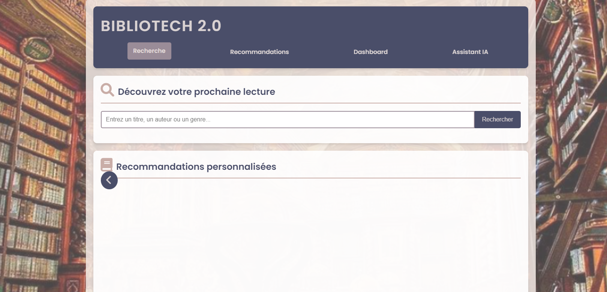

# Bibliotech 2.0 - Système de Recommandation de Livres

## À propos

Bibliotech 2.0 est un système de recommandation de livres utilisant des techniques de machine learning et de l'IA générative . Cette application web permet aux utilisateurs de découvrir de nouveaux livres basés sur leurs préférences, d'obtenir des recommandations personnalisées, et d'explorer les tendances de lecture actuelles avec un  chatbot.

## Démo

Vous pouvez essayer la version en ligne de Bibliotech 2.0 ici : [https://book-recommender-946681472540.europe-west9.run.app/](https://book-recommender-946681472540.europe-west9.run.app/)




## Dataset

Ce projet utilise le dataset "Book Recommendation Dataset" disponible sur Kaggle : [https://www.kaggle.com/datasets/arashnic/book-recommendation-dataset](https://www.kaggle.com/datasets/arashnic/book-recommendation-dataset)

### Stockage du dataset dans Google Cloud Storage (GCS)

1. Téléchargez le dataset depuis Kaggle
2. Créez un bucket dans Google Cloud Storage
3. Uploadez les fichiers CSV du dataset dans votre bucket GCS

### Accès aux données depuis Python

Pour accéder aux données stockées dans GCS depuis votre application Python, utilisez la bibliothèque `google-cloud-storage`. Voici un exemple de code :

```python
from google.cloud import storage

def download_from_gcs(bucket_name, source_blob_name, destination_file_name):
    storage_client = storage.Client()
    bucket = storage_client.bucket(bucket_name)
    blob = bucket.blob(source_blob_name)
    blob.download_to_filename(destination_file_name)
    print(f"Downloaded {source_blob_name} from {bucket_name} to {destination_file_name}.")

# Utilisation
download_from_gcs('your-bucket-name', 'path/to/your/file.csv', 'local_file.csv')
```

Assurez-vous d'avoir configuré les credentials GCP correctement dans votre environnement.

## Exécution locale de l'application web

Pour exécuter l'application localement, suivez ces étapes :

1. Clonez le dépôt :
   ```
   git clone https://github.com/your-username/Recommenders-Systems.git
   cd Recommenders-Systems
   ```

2. Créez un environnement virtuel et activez-le :
   ```
   python -m venv .venv
   source .venv/bin/activate  # Sur Windows, utilisez `.venv\Scripts\activate`
   ```

3. Installez les dépendances :
   ```
   pip install -r requirements.txt
   ```

4. Configurez les variables d'environnement :
   Créez un fichier `.env` à la racine du projet et ajoutez les variables nécessaires (clés API, etc.)

5. Lancez l'application :
   ```
   python app.py
   ```

6. Ouvrez votre navigateur et accédez à `http://localhost:8000`

## Configuration du projet Google Cloud

1. Créez un nouveau projet sur Google Cloud Console
2. Activez les APIs nécessaires (Cloud Run, Container Registry, Cloud Storage, etc.)
3. Configurez les credentials et les permissions appropriées
4. Créez un bucket GCS pour stocker votre dataset

## CI/CD et Déploiement sur Cloud Run avec Docker

Ce projet utilise GitHub Actions pour le CI/CD. Le pipeline est configuré pour :

1. Exécuter les tests à chaque push
2. Construire une image Docker
3. Pousser l'image vers Google Container Registry
4. Déployer l'application sur Cloud Run

Pour configurer le déploiement :

1. Ajoutez les secrets nécessaires dans vos paramètres GitHub (GCP_PROJECT_ID, GCP_SA_KEY, etc.)
2. Assurez-vous que le fichier `.github/workflows/main.yml` est correctement configuré
3. Poussez vos changements vers la branche principale pour déclencher le déploiement

## Technologies utilisées

### Backend
- Python
- Flask
- Pandas
- Scikit-learn
- Google Cloud Storage
- OpenAI API

### Frontend
- HTML/CSS/JavaScript
- Chart.js pour les visualisations

## Contribution

Les contributions sont les bienvenues ! N'hésitez pas à ouvrir une issue ou à soumettre une pull request.
